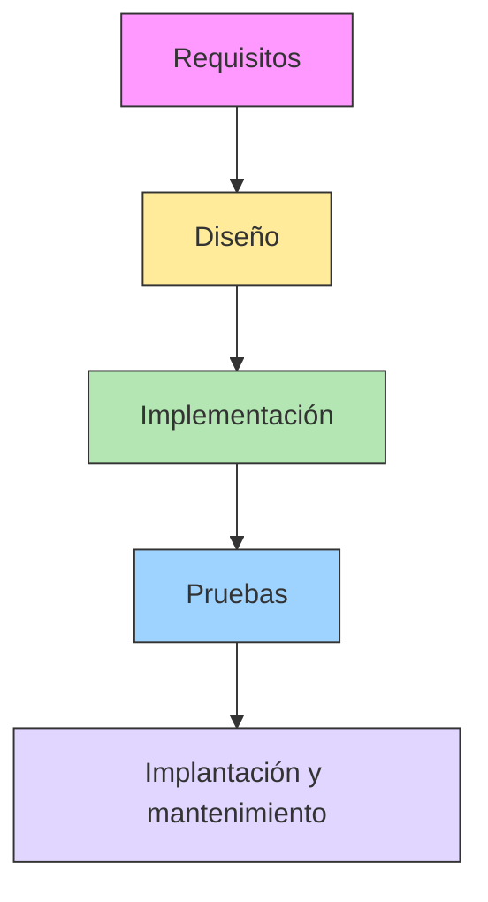
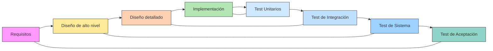

# Metodologías Tradicionales

En este capítulo vamos a centrarnos en las metodologías tradicionales, también llamadas predictivas, que se caracterizan por una fuerte planificación inicial y una ejecución lineal de las fases del proyecto. Entre todas ellas, el modelo en cascada es la más representativa y conocida.

## ¿Qué son las metodologías tradicionales o predictivas?  

Las metodologías tradicionales de gestión y desarrollo de proyectos se basan en una idea clave:  

> **Si planificamos al detalle desde el principio, podremos predecir y controlar el desarrollo del proyecto.**

### Características principales  

- **Secuencialidad**: el proyecto se divide en fases, que deben completarse en un orden concreto.  
- **Planificación exhaustiva**: se dedica mucho tiempo al inicio a detallar objetivos, recursos, calendario y presupuesto.  
- **Documentación abundante**: cada fase genera (muchos) documentos que sirven de base para la siguiente.  
- **Poca flexibilidad al cambio**: una vez aprobada la planificación, los cambios son costosos y complicados de implementar.  

Estas metodologías se aplican con éxito en sectores como la **ingeniería civil** o la **construcción**, donde es crítico tenerlo todo definido antes de empezar. Sin embargo, en informática presentan algunas limitaciones debido a la incertidumbre y la variabilidad de los requisitos.  

## El modelo en cascada  

### Definición  

El **modelo en cascada** (*Waterfall Model*) es una metodología secuencial de desarrollo en la que el progreso se concibe como una **serie de fases que “caen” una tras otra**, como una cascada.  

Cada fase debe completarse totalmente antes de pasar a la siguiente.  

### Fases principales del modelo en cascada  

1. **Requisitos**: recogida y análisis detallado de lo que necesita el cliente.  
2. **Diseño**: definición de la arquitectura del sistema y del software.  
3. **Implementación (codificación)**: programación del sistema conforme al diseño.  
4. **Pruebas**: verificación de que el software funciona según lo previsto.  
5. **Implantación y mantenimiento**: instalación en el entorno del cliente y corrección de errores detectados.  

### Ventajas del modelo en cascada  

- **Claridad**: fácil de entender y de gestionar, especialmente para equipos noveles.  
- **Documentación completa**: cada fase queda reflejada en documentos, lo que facilita el control.  
- **Previsibilidad**: al estar todo definido desde el inicio, se puede estimar con precisión tiempo y costes.  
- **Útil en proyectos muy estables**: funciona bien cuando los requisitos están claros y no van a cambiar.  

### Inconvenientes del modelo en cascada  

- **Rigidez**: un cambio de requisitos implica rehacer fases anteriores, con alto coste.  
- **Riesgo de entregas tardías**: el cliente no ve resultados hasta las fases finales.  
- **Poca adaptación al cambio**: el modelo no encaja bien con la naturaleza cambiante del software.  
- **Efecto “bola de nieve”**: un error en una fase inicial puede arrastrarse hasta el final.  

## Otros modelos predictivos relacionados  

Aunque el **cascada** es el más famoso, existen otros enfoques predictivos:  

- **Modelo en V**: similar a cascada, pero enfatiza la verificación y validación, relacionando cada fase de desarrollo con su fase de pruebas correspondiente.  

- **PRINCE2 y PMBOK**: marcos de gestión que aportan procesos y guías para proyectos grandes, aunque no son exclusivos del software.  

## Ejemplo práctico

### Desarrollo de una app de reservas de aulas

Supongamos que debemos crear una aplicación que permita al profesorado reservar aulas (proyector, laboratorio, sala de informática) y recursos desde el móvil o navegador.

:::: tabs
== Cascada

Aquí las fases se hacen **una detrás de otra**, sin retroalimentación hasta el final:

### 1. Requisitos

1. El equipo recoge lo que pide la dirección:

    - Listado de aulas.
    - Sistema de reservas por franja horaria.
    - Autenticación por usuario y contraseña.

2. Se documenta y se cierra la fase.

### 2. Diseño

1. Se definen diagramas UML, arquitectura cliente-servidor y el diseño de la base de datos.
2. También se dibujan prototipos de pantallas.
3. Se entrega un documento de diseño completo.

### 3. Implementación (codificación)

- Los programadores desarrollan la aplicación entera según el diseño.
- No hay entregas parciales.

### 4. Pruebas

Solo al final se hacen pruebas:

    - Fallos en login.
    - Problemas con solapamiento de reservas.
    - Errores en interfaz móvil.

> Cualquier error importante obliga a reabrir fases pasadas.

### 5. Implantación y mantenimiento

- Se instala la app en los dispositivos.
- Se corrigen incidencias de producción.

  **Problema típico en cascada**: si en la fase de pruebas descubren que también necesitan reservar *material de aula* (ej. proyectores portátiles), es demasiado tarde, por lo tanto habría que rehacer diseño e implementación.

---

== Modelo en V

En este modelo, cada fase de desarrollo se empareja con una fase de pruebas/verificación:

### 1. Requisitos ↔ Prueba de aceptación

- Se definen requisitos con el instituto.  
- Al final, se harán **pruebas de aceptación** para verificar que cumplen lo pedido (ej.: un profesor realmente puede reservar un aula con un clic).

### 2. Diseño de alto nivel ↔ Prueba de sistema

- Arquitectura cliente-servidor y base de datos.  
- Se validará con **pruebas de sistema**: comprobar que todo el flujo (login → reserva → confirmación) funciona de extremo a extremo.

### 3. Diseño detallado ↔ Prueba de integración

- Detalle de módulos: login, gestión de aulas, reservas.  
- Luego se hacen **pruebas de integración** para verificar que módulos distintos se comunican bien (ej.: login pasa datos al módulo de reservas).

### 4. Implementación ↔ Prueba unitaria

- Se programan las funciones y clases.  
- Cada función se prueba de manera individual (ej.: `reservar_aula()` devuelve error si el aula ya está ocupada).

::::