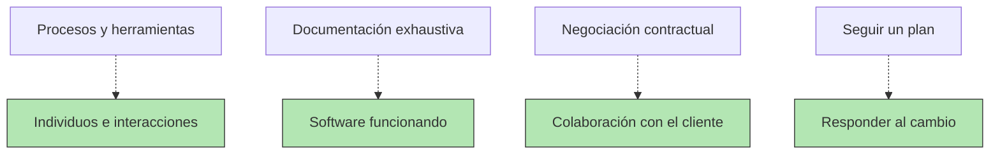

# Metodologías Ágiles

Aunque las metodologías predictivas fueron las primeras que se implantaron en el mundo del desarrollo al ser extrapoladas de otros contextos previos más experimentados (como la construcción), la mayor complejidad de los nuevos proyectos (con muchas más partes, recursos y tecnología implicados), la competencia y las necesidades de acortar plazos, han hecho que las ágiles tengan cada vez más adeptos y a día de hoy sean las más asentadas.

¿En qué consisten?. Son enfoques que promueven el desarrollo iterativo e incremental. Se centran en la entrega continua de valor, la colaboración, la adaptación al cambio y la retroalimentación constante.

## El manifiesto ágil

En 2001, un grupo de 17 expertos en desarrollo de software se reunieron en Utah (EE. UU.) para reflexionar sobre cómo mejorar los procesos de desarrollo, cansados de la rigidez de las metodologías tradicionales. De ese encuentro nació el **Manifiesto Ágil**, un documento breve que marcó un antes y un después en la gestión de proyectos informáticos.

El manifiesto se basa en **4 valores fundamentales** y **12 principios**.  

### Los 4 valores del Manifiesto Ágil

| Valor tradicional | Valor Ágil |
|-------------------|------------|
| **Procesos y herramientas** | **Individuos e interacciones** |
| **Documentación exhaustiva** | **Software funcionando** |
| **Negociación contractual** | **Colaboración con el cliente** |
| **Seguir un plan** | **Responder al cambio** |

 > ❗ Estos valores no rechazan lo que aparece a la izquierda, pero dan prioridad a lo que aparece a la derecha.

### Los 12 principios del Manifiesto Ágil

|  | Principio | Ejemplo |
|:--: | :-- | :-- |
| 1 | Satisfacer al cliente mediante entregas tempranas y continuas de software *útil* | Publicar una versión beta de una app para recibir feedback rápido. |
| 2 | Aceptar cambios en los requisitos, incluso en fases tardías | Si el cliente pide añadir autenticación por redes sociales en la app, se integra en la siguiente iteración. |
| 3 | Entregar software funcional con frecuencia (semanas en lugar de meses) | cada sprint de Scrum produce un incremento utilizable del producto | 
| 4 | Colaboración diaria entre negocio y desarrolladores | Reuniones cortas donde el cliente valida avances y prioriza tareas |
| 5 | Construir proyectos en torno a individuos motivados | Dar autonomía a los programadores para elegir cómo resolver un problema técnico |
| 6 | Favorecer la comunicación cara a cara (o síncrona) | Una _daily meeting_ en videollamada es más efectiva que una cadena de correos |
| 7 | El software funcionando es la principal medida de progreso | No importa tener documentos bonitos si la aplicación aún no hace lo básico |
| 8 | Procesos sostenibles: los equipos deben poder mantener un ritmo constante indefinidamente | Evitar picos de trabajo de 70 horas semanales que queman al equipo |
| 9 | La excelencia técnica y el buen diseño aumentan la agilidad | Refactorizar código y aplicar buenas prácticas de testing mejora la capacidad de adaptación |
| 10 | La simplicidad (maximizar el trabajo no hecho) es esencial | No programar funciones “por si acaso” que nadie ha pedido |
| 11 | Las mejores arquitecturas, requisitos y diseños emergen de equipos autoorganizados | Los desarrolladores deciden cómo estructurar microservicios, en vez de recibir todo desde arriba. |
| 12 | El equipo reflexiona regularmente para ser más efectivo y ajusta su comportamiento en consecuencia | Retrospectivas al final de cada sprint para mejorar la forma de trabajar |

## Ventajas 

* **Flexibilidad y adaptabilidad**: Permiten responder rápidamente a los cambios en los requisitos del cliente o del mercado.
* **Reducción de riesgos**: Al entregar pequeñas partes del proyecto de forma regular, los problemas se identifican y corrigen más rápido.
* **Mayor satisfacción del cliente**: El cliente está involucrado en todo el proceso y ve resultados tangibles desde las primeras etapas.

## Inconvenientes

* Requiere disciplina: Puede ser menos estructurada y exige mucha autodisciplina por parte del equipo.

* Documentación limitada: La prioridad es el producto funcional, por lo que la documentación puede ser menos detallada.

## Ejemplos de metodologías ágiles:

  **Scrum**. El más popular.

  **Kanban**. Se centra en la visualización del flujo de trabajo.

  **Extreme Programming (XP)**. Enfocado en prácticas de ingeniería de software de alta calidad.
