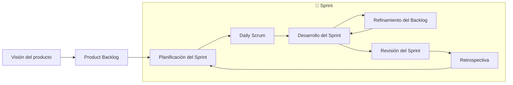

# Scrum (I)

Es posiblemente la metodología ágil más aplicada. El nombre proviene del inglés y significa _melé_, que es la formación que se utiliza en el rugby para reiniciar el juego en algunos momentos del partido. Esta analogía se usa para describir el enfoque del equipo, que trabaja unido y de forma compacta para avanzar hacia un objetivo común.

_Scrum_ se basa en tres pilares fundamentales: ceremonias (eventos), artefactos (herramientas) y roles (personas). Estos componentes están interconectados y son esenciales para el funcionamiento de la metodología.

-   **Roles**: _Product Owner_ (el responsable del _Product Backlog_), _Scrum Master_ (ayuda al equipo a entender y usar _Scrum_) y _Development Team_ (un equipo auto-organizado y multifuncional de personas que realizan el trabajo de entregar un _incremento_ de producto "Terminado" potencialmente desplegable al final de cada _Sprint_).

-   **Ceremonias:** _Sprint_, _Sprint Planning_ (donde se planifica el trabajo a realizar durante el _Sprint_), _Daily Scrum_ (reunión diaria de 15 minutos para que el equipo de desarrollo sincronice tareas), _Sprint Review_ (donde se inspecciona el incremento y se adapta el _Product Backlog_ si es necesario) y _Sprint Retrospective_ (donde el equipo reflexiona sobre el _Sprint_ pasado y planifica mejoras para el próximo).

-   **Artefactos**: _Product Backlog_, _Sprint Backlog_ (un plan de tareas para entregar el incremento del proyecto) y el _incremento_ que es producto con la suma de todos los elementos del _Product Backlog_ completados durante un _Sprint_.

## El Sprint

Un _Sprint_ es la unidad básica de trabajo en _Scrum_. Se trata de un período de tiempo fijo en el que el equipo desarrolla un _incremento_ del producto que debe ser **funcional y potencialmente entregable al cliente**.

### Características principales

* Duración fija: normalmente entre 1 y 4 semanas, siendo 2 (10 días laborales) semanas la más habitual.

* Objetivo claro: cada sprint tiene un objetivo, llamado _Sprint Goal_, que guía al equipo sobre lo que se quiere lograr.

* Contenido variable: lo que se incluye en el sprint se decide en la planificación inicial y procede del _Product Backlog_.

* No se alarga ni se acorta: si algo no se termina, se reevalúa para el siguiente sprint, pero **el tiempo no cambia**.

* Transparencia y adaptación: durante el sprint se celebran las reuniones clave (_Daily, Refinamiento, Revisión y Retrospectiva_) que aseguran la inspección continua del progreso y del proceso.

### Propósito

El _Sprint_ permite entregar valor de forma iterativa e incremental. Cada ciclo es una oportunidad de:

* Entregar un producto usable.

* Recibir feedback del cliente o stakeholders.

* Aprender y mejorar tanto el producto como la forma de trabajar del equipo.

Una planificación temporal para un periodo de 2 semanas podría ser:

```mermaid
gantt
    dateFormat  x
    axisFormat  %L
    section Inicio
    Planificación del Sprint   :a1, 0, 1
    section Ejecución
    Desarrollo + Daily Scrum   :a2, 1, 8
    Refinamiento del Backlog   :a3, 2, 7
    section Cierre
    Revisión del Sprint        :a4, 8, 9
    Retrospectiva              :a5, 9, 10
```

  > Un _Sprint_ es un pequeño proyecto dentro del proyecto global, con su propio objetivo y resultado tangible.

## El Product Backlog

El **Product Backlog** es el corazón de _Scrum_. Físicamente hablando es una lista **dinámica y priorizada** que contiene todo lo necesario para desarrollar el producto, desde funcionalidades hasta mejoras técnicas o correcciones, pero dentro del concepto de _Scrum_ es **herramienta estratégica de comunicación y ordenación** que conecta la visión del producto con el trabajo diario del equipo. 

No es un documento cerrado, sino un _artefacto_ vivo y en constante evolución, que refleja en cada momento lo que el equipo de desarrollo debería abordar para maximizar el valor entregado.

### ¿Cómo se construye?

El **Product Owner** es responsable de su gestión. Inicialmente se redactan los **requisitos del producto** en forma de **historias de usuario** u otros ítems de trabajo, que expresan qué se necesita y por qué. Cada ítem suele incluir:

- Una **descripción breve** de la necesidad.
- Su **valor para el negocio**.
- Una **estimación de esfuerzo** (puntos de historia, horas, etc.).
- Una **prioridad relativa**.

### Estructura y mantenimiento

Habitualmente se representa como una lista ordenada, donde los elementos más prioritarios están en la parte superior, **bien detallados y listos para entrar en un Sprint**. Los de menor prioridad, en cambio, pueden ser más vagos y se irán refinando con el tiempo.

El proceso de refinamiento del _Product Backlog_ se realiza de manera continua, asegurando que las historias estén claras, estimadas y alineadas con los objetivos de producto.

### Buenas prácticas

- **Priorizar por valor**: lo más valioso para el cliente debe aparecer arriba.
- **Mantenerlo visible**: el backlog debe estar disponible y comprensible para todo el equipo.
- **Refinar regularmente**: dedicar tiempo en cada _Sprint_ a revisar, desglosar y aclarar ítems.
- **Definir bien el _Definition of Ready_**: así el equipo sabe cuándo un ítem está listo para planificarse.

### Errores comunes

- Tratarlo como una lista cerrada y no actualizarlo cuando cambian las necesidades.
- Incluir requisitos demasiado vagos o ambiguos que dificulten el desarrollo.
- Saturarlo con demasiados detalles de bajo nivel desde el inicio.
- Usarlo como un simple registro administrativo en vez de como una herramienta estratégica.

## El Product Owner

El **Product Owner (PO)** es una de las tres figuras clave junto al **Scrum Master** y el **Equipo de Desarrollo**. Su papel es fundamental porque actúa como la voz del producto dentro del equipo, asegurando que se construya lo que realmente aporta valor.

Se podría decir que es el puente entre la visión del producto y el trabajo diario del equipo ya que gracias a su labor, todos los componentes del equipo de _Scrum_ mantienen una dirección clara y se asegura de que cada incremento entregue valor real.

### Responsabilidades principales

- **Gestionar el _Product Backlog_**. Es el responsable único de mantenerlo actualizado, priorizado y claro para todo el equipo.  
- **Escribir historias de usuario**. Traduce las necesidades del cliente o negocio en historias comprensibles para el equipo de desarrollo.  
- **Definir criterios de aceptación**. Especifica las condiciones que debe cumplir cada historia para considerarse terminada.  
- **Definir el MVP**. Selecciona el conjunto de funcionalidades esenciales que permiten validar el producto en el mercado.  
- **Aclarar dudas**. Trabaja junto al equipo de desarrollo para resolver preguntas sobre los requisitos y asegurar la comprensión.  
- **Priorizar por valor**. Decide qué ítems del backlog deben desarrollarse antes en función del beneficio que aportan.  
- **Comunicarse con los _stakeholders_**. Los stakeholders son las partes interesadas externas al Scrum Team, pero que influyen en lo que se desarrolla, por ejemplo clientes, usuarios finales, dirección de la empresa de desarrollo u tros equipos internos como los departamentos de marketing...

### Su posición en el equipo

Aunque el Product Owner suele ser alguien con gran conocimiento del producto (e incluso podría ser el cliente mismo), en Scrum su rol está enfocado en la gestión del _Product Backlog_ y en maximizar el valor que entrega el equipo.  

No trabaja como un cliente externo que “encarga” cosas, sino que **forma parte del equipo de Scrum** y colabora estrechamente con los desarrolladores y el Scrum Master.

### Características importantes

- **Es único**: solo puede haber un _Product Owner_ por producto. Esto evita conflictos de prioridades y asegura que haya una única visión de producto.  
- **Cercanía al negocio y al equipo**: debe entender tanto lo que quiere el cliente como las capacidades del equipo.  
- **Decisión y liderazgo**: sus decisiones sobre el backlog son definitivas y deben ser respetadas por todos.  

### Qué no hace un Product Owner

- No dicta cómo se hace el trabajo técnico, eso es responsabilidad del equipo de desarrollo.  
- No cambia prioridades durante un _Sprint_ en curso (el _Sprint Backlog_ es estable).  
- No actúa como jefe del equipo. Él guía, aclara y prioriza, pero no gestiona personas.  
